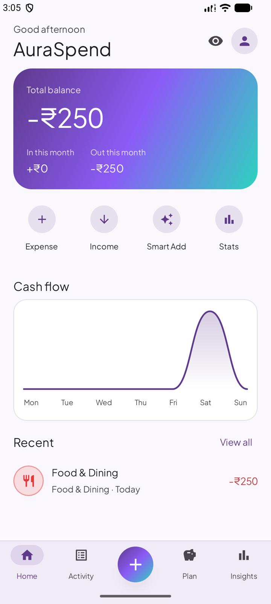
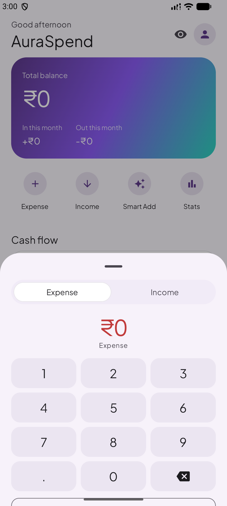
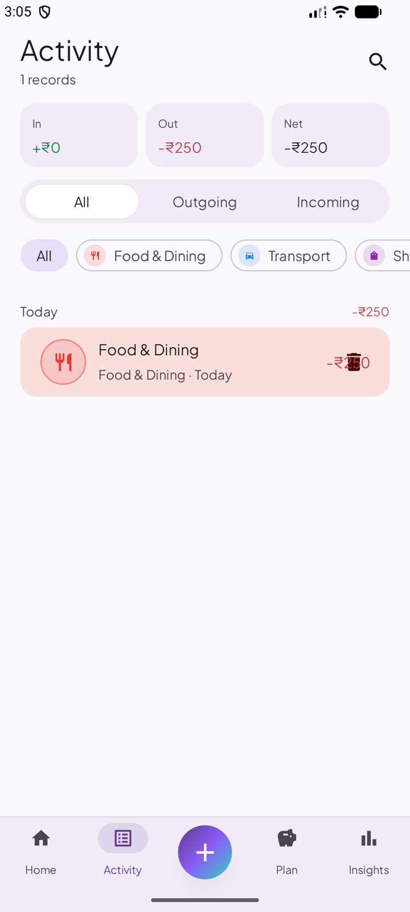
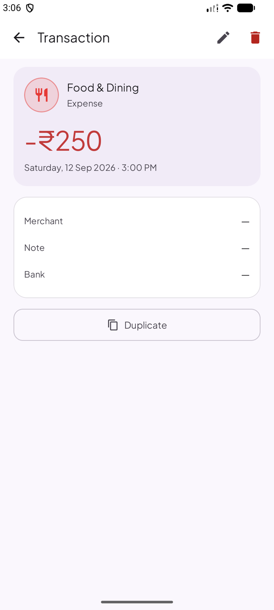
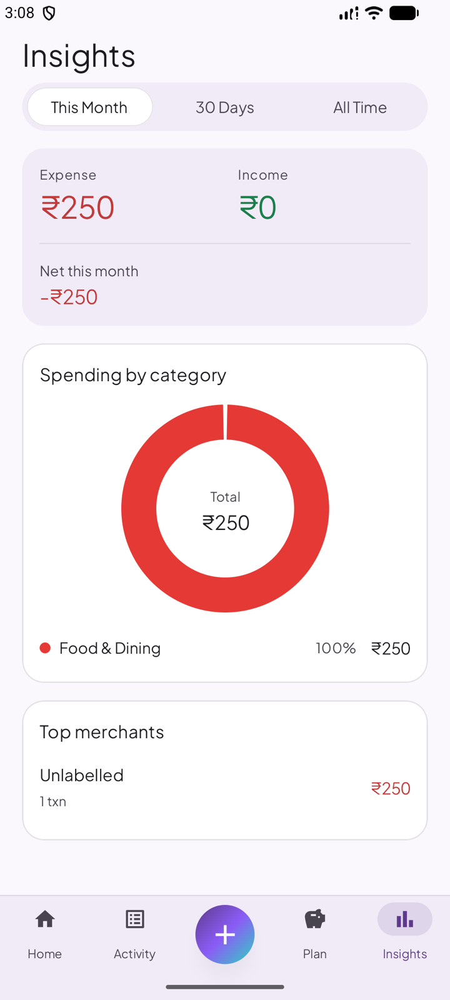
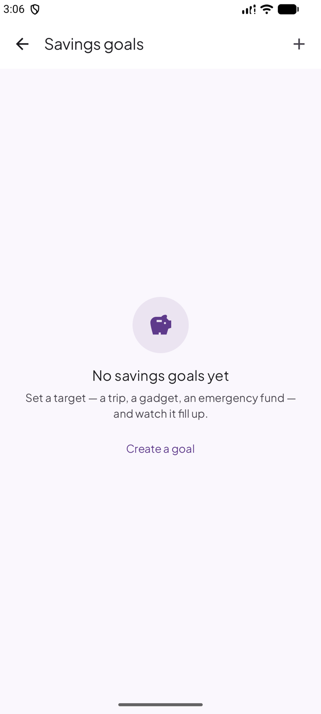
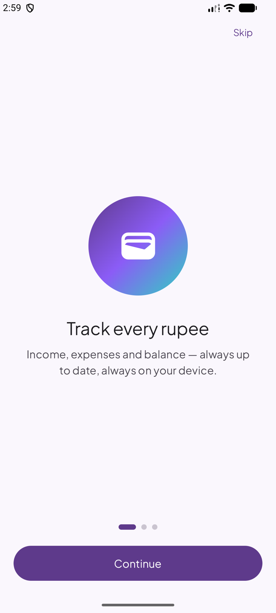
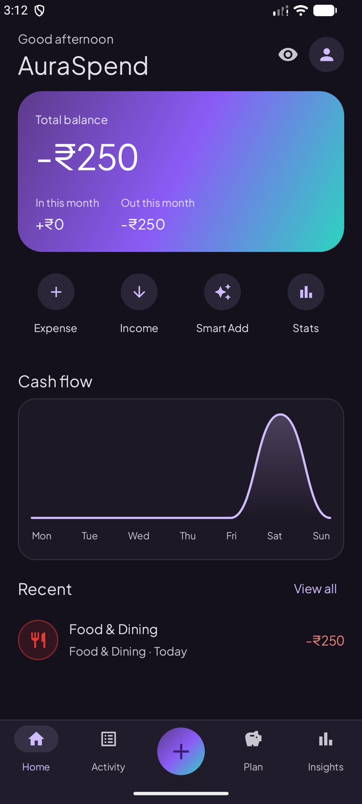
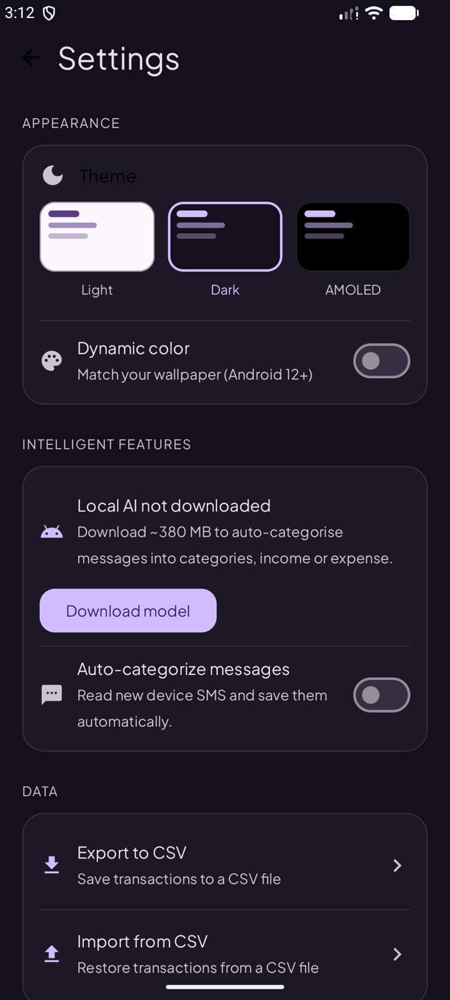

# AuraSpend

[](LICENSE)
[](app/build.gradle.kts)
[](app/build.gradle.kts)
[](build.gradle.kts)
[](https://github.com/auraspend/auraspend/actions/workflows/ci.yml)

A world-class expense manager for Android 17 (API 37) with bank message classification, edge-to-edge Material 3 UI, budget tracking, and Google Drive backup.

Made with ❤️ by AW Builds

---

## Features

| Category | Details | Availability |
|----------|---------|---------|
| **Smart Classification** | Paste bank SMS or read from inbox — auto-categorizes via sender-routed bank parsers + an optional 22 MB on-device encoder into subscriptions / categories / income / expense / other | Free |
| **Dashboard** | Balance card, weekly bar chart, budget progress, subscription summary, category breakdown | Free |
| **Transaction List** | Search, date groups, swipe-to-delete, expense/income filters | Free |
| **Budgets** | Per-category monthly/weekly/yearly spending limits with progress bars | Free |
| **Recurring Subscriptions** | Track monthly costs, next billing dates | Free |
| **CSV Export/Import** | Backup and restore your transactions | Free |
| **Dark & AMOLED Theme** | Light, Dark, and true-black AMOLED modes | Free |
| **Advanced Analytics** | Canvas pie charts, category breakdowns, merchant insights | Free |
| **Google Drive Backup** | Cloud sync and restore from onboarding | Free |

## On-Device AI (Local Categorization)

AuraSpend can run a small, fully-on-device model to improve message
auto-categorization into **subscriptions, categories, income, expense and other**.

- **22 MB, not 400 MB.** The model is a quantised `all-MiniLM-L6-v2` sentence
  **encoder** (int8, ONNX), Apache-2.0 licensed. Downloaded at runtime from
  HuggingFace after user consent, and SHA-256 verified before it is allowed
  anywhere near the models directory.
- **Why an encoder, not a language model.** The job is a closed-vocabulary
  decision over a bank SMS, not text generation. Five runtimes were measured
  through the production pipeline; a 468 MB Qwen-0.5B decoder *deleted* 8 of 46
  real transactions because it mistook them for OTPs, and the 22 MB encoder
  deletes **none**. The measured table is in
  [`docs/evals/README.md`](docs/evals/README.md).
- **Consent first**: the first time you open **Smart Add**, the app offers to add
  the categoriser (a 22 MB download, so it is an inline offer rather than a modal
  dialog). Accepting starts a **background download** (resumable, cancellable) to
  internal storage — nothing leaves the device.
- **Progress everywhere**: the download progress is shown **in-app** (Smart Add banner + Settings card) **and in a
  system notification** that updates live and clears when the download finishes.
- **A gap-filler, never a gatekeeper**: amount / merchant / date come from the
  battle-tested regex parser (`BankMessageParser`), and the model fills only the
  gaps it left — *subscription detection, category selection, income-vs-expense*.
  On any conflict the parser's answer wins. A model may never discard a
  transaction on its own: `AiSignalFusion` requires both a calibrated probability
  *and* that the parser found no amount, because a false veto **deletes** a real
  debit rather than mis-filing it. If the model isn't downloaded, the app
  transparently falls back to the pure regex classifier, so nothing breaks.
- **Sender-routed bank parsers**: the SMS sender ID selects a hand-written parser
  for that bank's exact format (Axis, Canara, SBI), which is what resolves
  messages carrying both a real amount and a decoy available-limit figure.
- **Unreadable messages are surfaced, not dropped**: a bank SMS carrying an amount
  and a movement word that no parser can read is recorded so it can be filed by
  hand, rather than silently vanishing from your history.
- **Learned classification memory**: every save (manual or auto) records a normalized
  merchant/note → category mapping in a local Room table (`classification_memory`). Repeat
  merchants are categorized **instantly** — the model is skipped entirely — and your manual
  corrections always win over automated suggestions. Stored in `classification_memory`, migrated
  safely from previous schema versions (v5 → v6).
- **Multi-signal fusion** (`AiSignalFusion`): a calibrated "not a transaction" probability
  may null out a message only when it is ≥ 0.9 **and** the regex layer found no amount —
  confidence alone is never licence to discard; explicit *credited/debited* keywords beat a
  model type guess on conflict; recurring-payment keywords (auto-debit, NACH, renewal…) force
  subscription classification even without the model; confidence rises when signals agree and
  drops when they conflict.
- **Manage it**: the **Smart categories** card in Settings shows status and lets
  you download, cancel and delete the model.

### Build prerequisites

No native toolchain is needed. Inference runs on **ONNX Runtime**, a Maven AAR
rather than a compiled C++ module, so a stock JDK and the Android SDK are
sufficient — the NDK/CMake requirement of earlier releases is gone along with
`llama-lib/`.

### Toolchain

| Component | Version |
|-----------|---------|
| Gradle    | 9.5.0   |
| AGP       | 9.3.1 (built-in Kotlin, KGP 2.2.10) |
| Kotlin / Compose compiler | 2.2.10 |
| compileSdk / targetSdk    | 37 |
| minSdk    | 30 |
| R8        | Full mode (minify + optimize + obfuscate + resource shrinking) |

```bash
# no submodule to fetch - the native runtime is a Maven AAR
./gradlew assembleDevDebug
```

The model is Apache-2.0 licensed (`all-MiniLM-L6-v2`). It is downloaded at
runtime from HuggingFace after user consent, and its SHA-256 is verified before
use.

## Build Flavors

Two environments, one feature set. `dev` exists so a development build can sit
next to the store build on one device; `prod` is what ships.

| Flavor | Command | Use Case |
|--------|---------|----------|
| `dev`  | `./gradlew assembleDevDebug` | Development / QA — id `.dev`, label "AuraSpend Dev" |
| `prod` | `./gradlew assembleProdDebug` | The store build (`com.awbuilds.auraspend`) |

**Every feature is available in both flavors, and neither build carries
analytics or ads.** AuraSpend has no paywall, no tracking and no ad SDKs — the
claim that your bank SMS never leaves your phone is true of every build we
publish.

The flavors change configuration only — application-id suffix, label and
signing. **No feature may live in a flavor source set that is absent from
`app/src/main/`** — see [ADR 0007](docs/adr/0007-no-paywall.md),
[ADR 0008](docs/adr/0008-distribution-flavors.md) and
[ADR 0010](docs/adr/0010-dev-prod-flavors.md).

### Building a release

```bash
./gradlew assembleProdRelease    # prod APK (self-install / GitHub Releases / website)
./gradlew bundleProdRelease      # prod AAB (Play Store)
```

Release builds require a keystore in `secrets.properties` (see
`secrets.properties.example`). **Without it the build still succeeds but
produces an `…-unsigned.apk`**, which Play and self-installers will reject —
check the filename before uploading.

Pushing a `v*` tag runs the release workflow, which builds both, verifies the
signatures, and attaches them to a GitHub Release as
`AuraSpend-V<version>.Alpha.{aab,apk}` — see
`.github/workflows/release.yml`. It never uploads to Play.

### Google Drive backup

Drive backup is optional and user-owned in every build: the backup lives in
**your own Google Drive**, and the project operates no servers and never sees
it.

- **Installed from Google Play** — sign in with your Google account; the
  Play-signed build is registered for Drive sign-in, so this works out of the
  box.
- **Self-built** — Google Sign-In authorizes against an OAuth client
  registered for the app's package id **and signing certificate**, so a build
  signed with your own key needs its own OAuth client in a Google Cloud
  project (type *Android*, your package id + your signing SHA-1). Your backup
  still goes to your own Drive.
- **No Google account?** CSV export/import works in every build without any
  Google service — Settings → Data.

## Tech Stack

- **Language**: Kotlin
- **UI**: Jetpack Compose + Material 3 (Expressive), Aurora design system (`ui/designsystem`)
- **Typography**: Plus Jakarta Sans (bundled, variable) with tabular figures for money
- **Architecture**: Clean Architecture + MVI (Unidirectional data flow)
- **DI**: Manual (Application class) — no Hilt/Koin
- **Local Storage**: Room Database (indexed; SQL aggregates; Paging 3)
- **Charts**: Canvas-based, animated (no external charting library)
- **Cloud**: Google Drive API v3
- **Localization**: English + Hindi (`values-hi`), full string resources
- **Performance**: baseline-profile-ready, Macrobenchmark module (`:benchmark`)
- **Target SDK**: Android 17 (API 37)
- **Min SDK**: Android 11 (API 30)

## Project Structure

```
app/src/
├── main/java/com/awbuilds/auraspend/
│   ├── core/                 # AuraLog + the boundary { } try/catch helpers
│   ├── data/
│   │   ├── ai/               # OnDeviceClassifier seam, encoder runtime, model download
│   │   ├── classification/   # Bank parsers, regex layer, AI fusion, SMS intake
│   │   ├── local/            # Room DB, DAOs, entities, CSV manager
│   │   ├── privacy/          # SensitiveDataMasker
│   │   ├── remote/           # Google Drive backup
│   │   └── repository/       # Repository implementations
│   ├── domain/
│   │   ├── model/            # Core domain models
│   │   ├── repository/       # Repository interface
│   │   └── usecase/          # Business logic use cases
│   ├── ui/
│   │   ├── analytics/        # Pie charts, spending insights
│   │   ├── budget/           # Per-category budget tracking
│   │   ├── category/         # Category management
│   │   ├── classification/   # SMS classification screen
│   │   ├── core/             # Shared scaffold, navigation bar
│   │   ├── designsystem/     # Aurora tokens + reusable components — use these
│   │   ├── home/             # Dashboard with charts
│   │   ├── navigation/       # NavGraph, route definitions
│   │   ├── onboarding/       # First-launch wizard
│   │   ├── plan/             # Plan hub (budgets + subscriptions + goals)
│   │   ├── recurring/        # Subscription management
│   │   ├── savings/          # Savings goals
│   │   ├── settings/         # Settings
│   │   ├── splash/           # Animated splash screen
│   │   ├── theme/            # M3 colors, light/dark/AMOLED
│   │   └── transaction/      # List + add/edit screens
│   └── AuraSpendApp.kt       # Application class (DI)
├── dev/                      # Dev flavor: manifest + "AuraSpend Dev" label only
└── prod/                     # Prod flavor: manifest only
```

The `dev` and `prod` source sets deliberately contain **no Kotlin**. Every
feature lives in `main`, so both flavors are identical apart from the dev
app-id suffix, label and signing — see
[ADR 0008](docs/adr/0008-distribution-flavors.md) and
[ADR 0010](docs/adr/0010-dev-prod-flavors.md).

## Getting Started

### Prerequisites

- Android Studio Koala or newer
- JDK 17+
- Android SDK 37

### Setup

```bash
git clone https://github.com/auraspend/auraspend.git
cd auraspend
cp secrets.properties.example secrets.properties
```

`secrets.properties` only matters for signed release builds — fill in the four
keystore values (see the comments in the template). Debug builds work without
it.

Build and run:

```bash
./gradlew assembleDevDebug
```

**First launch**: The app auto-seeds 12 default categories and shows the onboarding screen.

## Preview

| Home | Quick Add | Activity |
|---|---|---|
|  |  |  |

| Transaction detail | Insights | Savings goals |
|---|---|---|
|  |  |  |

| Onboarding | Dark theme | AMOLED settings |
|---|---|---|
|  |  |  |

The UI is built on the **Aurora design system** (`app/src/main/java/com/awbuilds/auraspend/ui/designsystem`):
brand purple + lavender + teal, Plus Jakarta Sans with tabular figures, hairline
borders instead of shadows, spring motion tokens and a light / dark / true-black
AMOLED theme. Screenshots are from the dev debug build.

## Testing

```bash
# Unit tests (JVM) — includes Robolectric + Roborazzi screenshot tests
./gradlew testProdDebugUnitTest

# Aurora screenshot baselines live in app/src/test/screenshots and are
# regenerated by the test run; CI fails if they change without being committed.

# Instrumented tests (requires emulator/device)
./gradlew connectedAndroidTest

# Cold-start macrobenchmark (release build, requires a device + the release
# keystore in secrets.properties)
./gradlew :benchmark:connectedProdBenchmarkAndroidTest

# Generate a baseline profile (requires a device; copy the produced
# baseline-prof.txt to app/src/main/baseline-prof.txt and commit)
./gradlew :benchmark:connectedProdBenchmarkAndroidTest \
  -Pandroid.testInstrumentationRunnerArguments.class=com.awbuilds.auraspend.benchmark.BaselineProfileGenerator
```

## Localization

The UI ships in **English** and **Hindi** (`values-hi`). All copy lives in
`strings.xml`; adding a language is a single `values-<code>/strings.xml`
file — contributions welcome.

## Contributing

Issues and pull requests are welcome! See [CONTRIBUTING.md](.github/CONTRIBUTING.md) for:

- Build flavor system explained
- Code style guide
- Pull request process
- Issue reporting guidelines

Contributions must carry a **copyright assignment**. This is not a formality
under AGPL: it is what keeps the project relicensable as a whole. The 0.1.1
relicensing from Apache-2.0 was only possible because there was a single
copyright holder, and that stops being true the moment a second person
contributes. If you would rather not assign copyright, open an issue describing
your idea instead — it costs you nothing and the work still gets done.

**First-time contributors**: Look for issues labeled `good first issue` or `help wanted`.

**Release process**: Every merge to `main` updates a draft release via [Release Drafter](.github/release-drafter.yml), grouping PRs by label. When ready to ship, publish the draft and tag it `vX.Y.Z` — the version is auto-bumped based on the highest priority label (`breaking` → major, `enhancement`/`feature` → minor, `bug`/`fix` → patch).

## Code of Conduct

Participation is governed by [CODE_OF_CONDUCT.md](.github/CODE_OF_CONDUCT.md).
Reports go to the address listed there and are handled confidentially.

## Security

See [SECURITY.md](.github/SECURITY.md) for reporting vulnerabilities.

## Support

- **Bugs and feature requests:** the issue templates. Please include device
  model, Android version, and steps to reproduce — see
  [CONTRIBUTING.md](.github/CONTRIBUTING.md).
- **Security:** do not open a public issue. Use
  [SECURITY.md](.github/SECURITY.md).
- **Anything else:** `awbuilds.support@gmail.com`.

## Changelog

See [CHANGELOG.md](CHANGELOG.md), which follows
[Keep a Changelog](https://keepachangelog.com/en/1.1.0/). Releases are drafted
automatically from merged pull requests.

## Roadmap

[ROADMAP.md](ROADMAP.md) holds the planned work. The decision log lives in
[docs/adr/](docs/adr/README.md) — short, durable records of why the project is
shaped the way it is, which is usually more informative than the roadmap.

## Acknowledgements

- **Jetpack Compose, AndroidX, Room, ONNX Runtime** and the rest of the
  dependency graph — see the attribution table below.
- **[Plus Jakarta Sans](https://fonts.google.com/specimen/Plus+Jakarta+Sans)**,
  under the SIL Open Font License, for the typeface.
- **[all-MiniLM-L6-v2](https://huggingface.co/sentence-transformers/all-MiniLM-L6-v2)**,
  Apache-2.0, for the sentence encoder that powers on-device categorisation.
- **[Lottie](https://airbnb.io/lottie/)**, Apache-2.0, for the onboarding and
  splash animations.
- Everyone who has filed an issue. The bug list this project grew from was
  largely other people's reports.

## License

Copyright 2026 AuraSpend

AuraSpend is free software: you can redistribute it and/or modify it under the
terms of the GNU Affero General Public License as published by the Free Software
Foundation, either version 3 of the License, or (at your option) any later
version.

This program is distributed in the hope that it will be useful, but WITHOUT ANY
WARRANTY; without even the implied warranty of MERCHANTABILITY or FITNESS FOR A
PARTICULAR PURPOSE. See the GNU Affero General Public License for more details.

You should have received a copy of the GNU Affero General Public License along
with this program. If not, see <https://www.gnu.org/licenses/>.

AuraSpend is also distributed on Google Play, and the prod APK for self-install
is published on [GitHub Releases](https://github.com/auraspend/auraspend/releases).
The full license text is in [`LICENSE`](LICENSE) and is readable in the app
under **Settings → About → Open-source licenses**.

### Why AGPL rather than Apache-2.0

AuraSpend was Apache-2.0 until 0.1.1. It moved to AGPL-3.0 for one reason: to
make sure that a modified AuraSpend offered to users over a network has to offer
its source too. Apache-2.0 permits exactly that — a proprietary hosted fork is
lawful — and AGPL-3.0 section 13 does not.

See [ADR 0009](docs/adr/0009-agpl-3.0-relicensing.md) for the full reasoning,
including what AGPL does *not* buy this project.

### Third-party components

AuraSpend bundles or downloads work under other licenses. These remain under
their own terms — the AGPL covers AuraSpend's own source, not theirs:

| Component | License | Notes |
|---|---|---|
| [Plus Jakarta Sans](https://fonts.google.com/specimen/Plus+Jakarta+Sans) | SIL OFL 1.1 | Bundled font, `app/src/main/res/font/` |
| [ONNX Runtime](https://onnxruntime.ai/) (Android) | MIT | Native inference runtime, Maven AAR |
| [Lottie](https://airbnb.io/lottie/) | Apache-2.0 | Bundled onboarding/splash animations |
| AndroidX (Room, Compose, Lifecycle, Work, Navigation) | Apache-2.0 | |
| Google API Client, Google Drive API, play-services-auth | Apache-2.0 | Drive backup only |
| OkHttp, Guava | Apache-2.0 | Transitive |
| [`all-MiniLM-L6-v2`](https://huggingface.co/sentence-transformers/all-MiniLM-L6-v2) | Apache-2.0 | **Downloaded at runtime**, not bundled |

The full texts are in [`docs/licenses/`](docs/licenses/) and in the app under
**Settings → About → Open-source licenses**.
